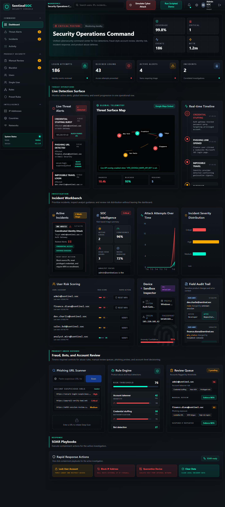
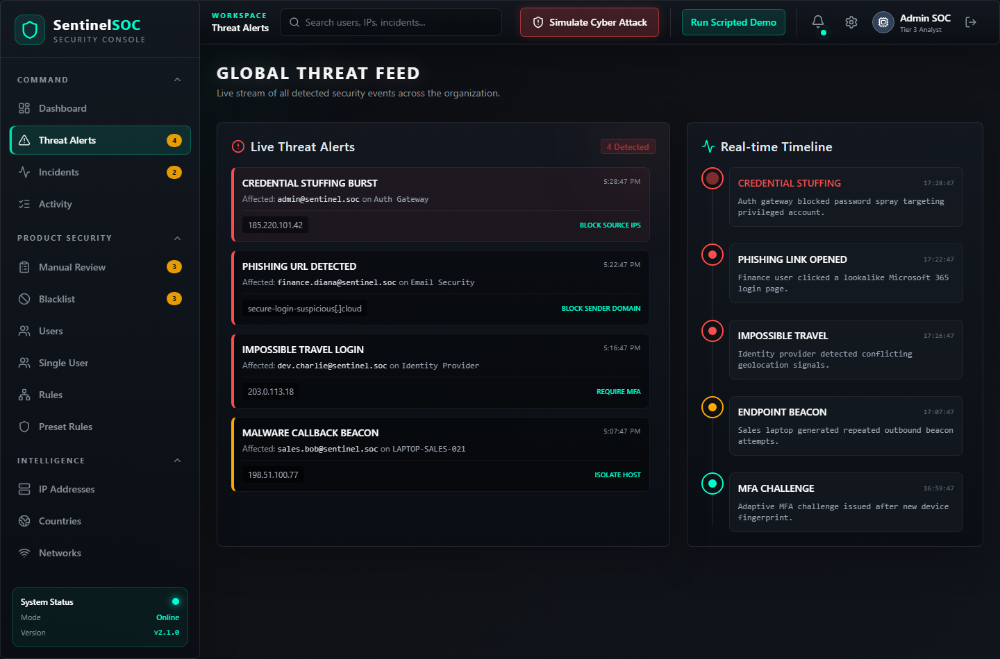

# 🛡️ SentinelSOC

## Enterprise Security Operations Center (SOC) Simulation Platform

SentinelSOC is a modern cybersecurity dashboard that simulates real-world Security Operations Center workflows. It provides threat monitoring, incident investigation, attack simulation, security analytics, and analyst response capabilities through an interactive web-based platform.

---

## 🔗 Live Demo

https://sentinelsoc-dashboard.onrender.com

## 📂 Repository

https://github.com/om-bhadauria/Project.2.-SentinalSOC

---

# 📖 Overview

Organizations face thousands of security events every day.

SentinelSOC provides a centralized platform where security analysts can monitor threats, investigate incidents, analyze suspicious activities, and simulate cyber attacks within a realistic SOC environment.

The project demonstrates practical cybersecurity concepts including threat detection, incident response, security monitoring, authentication security, and event correlation.

---

# ✨ Features

## 🛡️ Security Operations Dashboard

- Security posture monitoring
- Coverage metrics
- Critical event tracking
- MTTR monitoring
- Incident visibility
- Analyst workspace

## 🚨 Threat Detection

Simulated cyber attack detection including:

- Credential Stuffing
- Phishing Attempts
- Malware Beacon Activity
- Impossible Travel Logins
- Account Takeover Attempts
- Authentication Abuse

## 📊 Threat Intelligence Feed

- Real-time threat stream
- Threat severity indicators
- Affected assets visibility
- Threat investigation workflows
- Response recommendations

## ⏱️ Incident Response Timeline

- Detection
- Investigation
- Containment
- Mitigation
- Resolution

## 👤 Identity Security

- Login monitoring
- User investigations
- Authentication analysis
- MFA challenge tracking
- Account risk detection

## 🌍 Global Threat Monitoring

- Threat surface visibility
- Security telemetry
- Geographic activity monitoring
- Event correlation

## ⚡ Attack Simulation

Generate realistic security scenarios:

- Credential Stuffing
- Phishing Campaigns
- Malware Activity
- User Compromise Events
- Identity-Based Attacks

---

# 📸 Screenshots

## Security Operations Dashboard



## Global Threat Feed



---

# 🏗️ Architecture

```text
User
 │
 ▼
Frontend Dashboard
 │
 ▼
SOC Monitoring Engine
 │
 ├── Threat Detection
 ├── Incident Response
 ├── Security Analytics
 ├── Identity Monitoring
 └── Attack Simulation
 │
 ▼
Data Layer
```

---

# 🛠️ Technology Stack

## Frontend

- React.js
- JavaScript
- HTML5
- CSS3
- Tailwind CSS

## Backend

- Node.js
- Express.js

## Development Tools

- Git
- GitHub
- VS Code

## Deployment

- Render

---

# 📂 Project Structure

```text
Project.2.-SentinalSOC
│
├── ai
├── backend
├── docs
├── frontend
├── infra
├── scripts
├── seed
│
├── README.md
├── DEPLOYMENT.md
├── RENDER_DEPLOY.md
├── docker-compose.yml
├── docker-compose.override.yml
├── docker-compose-demo.yml
├── render.yaml
└── .env.example
```

---

# ⚙️ Installation

## Clone Repository

```bash
git clone https://github.com/om-bhadauria/Project.2.-SentinalSOC.git
```

## Navigate Into Project

```bash
cd Project.2.-SentinalSOC
```

## Install Dependencies

```bash
npm install
```

## Run Development Server

```bash
npm run dev
```

## Open Browser

```text
http://localhost:5173
```

---

# 🎯 Key Learning Outcomes

This project demonstrates:

- Security Operations Center (SOC) Concepts
- Cyber Threat Monitoring
- Incident Response Workflow
- Security Event Correlation
- Identity Protection
- Authentication Security
- Threat Intelligence Visualization
- Full Stack Application Development
- Security Dashboard Design

---

# 🚀 Future Improvements

- SIEM Integration
- MITRE ATT&CK Mapping
- Threat Intelligence APIs
- Machine Learning Threat Detection
- AI-Powered Alert Classification
- Security Case Management
- Analyst Collaboration
- Real-Time Notifications
- Advanced Threat Hunting
- Multi-Tenant Support

---

# 🤝 Contributing

Contributions are welcome.

1. Fork the repository

2. Create a feature branch

```bash
git checkout -b feature-name
```

3. Commit your changes

```bash
git commit -m "Add new feature"
```

4. Push your branch

```bash
git push origin feature-name
```

5. Open a Pull Request

---

# 👨‍💻 Author

## Om Bhadouriya

GitHub:
https://github.com/om-bhadauria

LinkedIn:
Add your LinkedIn profile here

---

# ⭐ Support

If you found this project useful:

- Star the repository
- Fork the repository
- Share the project

---

## 🛡️ SentinelSOC

Detect • Investigate • Respond

A Security Operations Center Simulation Platform
